# Apache Kafka 알아보기

## 목차

- Kafka 란?
- Kafka 등장 배경
- Kafka 개념 및 구성요소

## 카프카란 무엇인가?

빅데이터 플랫폼뿐만 아니라 MSA(Microservice Architecture) 구조의 백엔드 아키텍처에서도 중요한 역할을 수행하고 있는 아파치 카프카.

공식 문서를 베이스로 하여 아파치 카프카의 등장 배경과 기본 개념을 이해해봅시다.

https://kafka.apache.org/documentation/

## Apache Kafka 정의 소개

카프카는 **분산** **이벤트 스트리밍** 플랫폼입니다.

> [***Apache Kafka® is an event streaming platform.***](https://kafka.apache.org/documentation/#intro_platform)
>

**이벤트 스트리밍**의 정의는 다음과 같습니다.

- 이벤트 소스에서
    - 실시간으로 이벤트 스트림 형태의 데이터를 수집하고,
    - 영구적으로 저장하며,
    - 라우팅을 포함한 조작 및 처리를 할 수 있는 방식입니다.

여기서 ‘**이벤트**’는 비즈니스에서 ‘무언가 발생했다’는 사실 기록이며, ‘레코드’, ‘메시지’ 라고도 합니다.

‘**이벤트 소스**’는 이벤트가 발생한 곳으로 DB, 센서, 모바일 기기, 소프트웨어 애플리케이션 등이 있습니다.

‘**이벤트 스트림**’은 이벤트의 연속적인 흐름을 의미합니다.

> *Event streaming is the practice of capturing data in real-time from event sources like databases, sensors, mobile devices, cloud services, and software applications in the form of streams of events; storing these event streams durably for later retrieval; manipulating, processing, and reacting to the event streams in real-time as well as retrospectively; and routing the event streams to different destination technologies as needed*
>

## Kafka 등장 배경

https://www.linkedin.com/pulse/kafkas-origin-story-linkedin-tanvir-ahmed/

Kafka는 2010년경, LinkedIn 웹사이트와 인프라에서 발생하는 대규모 이벤트 데이터를 **지연 없이** 수집해, Hadoop과 실시간 이벤트 처리 시스템을 함께 활용하는 람다 아키텍처로 흘려보내는 것이었습니다. 핵심은 “실시간” 처리였는데,

LinkedIn은 이런 실시간 애플리케이션용 데이터 유입을 해결할 솔루션으로 Kafka를 개발했고, 현재는 오픈소스로 제공하고 있습니다.

## 왜 Kafka를 쓸까?

https://www.confluent.io/what-is-apache-kafka/
https://www.yes24.com/product/goods/99122569

카프카는 현재 포춘 100대 기업 중 80% 이상이 활용하고 있습니다. 국내에서도 배민, 카카오 등의 서비스 기업들이 카프카를 핵심 인프라로 사용하고 있는데요. 카프카는 어떻게 이러한 인기를 누리게 되었을까요?

## MSA가 불러온 Kafka 붐

글로벌 IT 기업의 사용자 규모가 폭발적으로 늘어나자 기업들은 서비스 단위의 독립적인 CI/CD, 장애 격리, Scale Out을 위해 기존 시스템을 모놀리식(Monolithic)에서 MSA(Microservices Architechture)로 전환하기 시작했습니다.

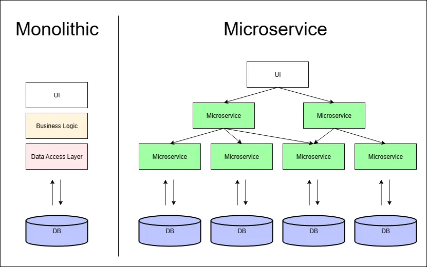

MSA 는 애플리케이션을 독립적으로 기능하는 더 작은 서비스 단위(Microservice)로 분해하는 것을 의미합니다. 이때 각각의 서비스들은 API를 통해 서로 통신합니다.

> *"the microservice architectural style is an approach to developing a single application as a suite of small services, each running in its own process and communicating with lightweight mechanisms, often an HTTP resource API. These services are built around business capabilities and independently deployable by fully automated deployment machinery."*
>

https://martinfowler.com/articles/microservices.html

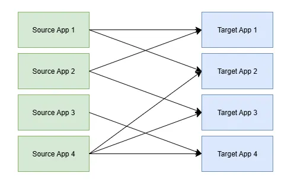

이러한 MSA 환경에서 데이터를 전송하는 소스 애플리케이션과 데이터를 수신하는 타겟 애플리케이션의 수가 늘어날 수록, **데이터 전송 라인이 복잡해졌고**, 이는 유지·보수를 어렵게 만들었습니다.

또한 애플리케이션 간 장애 전파를 막고 시스템 호환성을 보장하려면 데이터 포맷과 프로토콜, 특히 데이터 스키마의 일관성이 중요해졌습니다.

이러한 요구 속에서 많은 기업들이 서비스 간 결합도를 낮추고(decoupling) 안정적인 데이터 스트리밍을 보장하기 위해 **Kafka 클러스터**를 중앙 이벤트 허브로 도입하게 되었습니다.

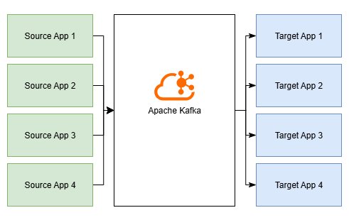

이제 본격적으로 Kafka의 개념과 구성 요소를 알아볼까요?

## Kafka 개념 및 구성 요소

카프카 시스템을 이해하기 위해서는 먼저 아래의 카프카 구성 요소를 이해해야 합니다. 원할한 이해를 위해 연관된 개념을 묶어서 소개하겠습니다.

1. 토픽 (Topic), 프로듀서 (Producer), 컨슈머 (Consumer)
2. 파티션 (Partition), 오프셋 (Offset), 컨슈머 그룹(Consumer Group)
3. 브로커(Broker), 복제 & ISR (Replication & ISR)

### 1. 토픽 (Topic), 프로듀서 (Producer), 컨슈머 (Consumer)

카프카에는 다양한 이벤트(데이터)를 저장할 수 있습니다. 이때 이벤트가 저장되는 논리적 공간을 ‘**토픽**’이라고 합니다. 다음과 같이 파일 시스템에 비유할 수 있습니다.

> 폴더 : 토픽
>
>
> 파일 : 이벤트
>

카프카는 Topic 에 대한 Pub/Sub 구조에 기반해 동작합니다.

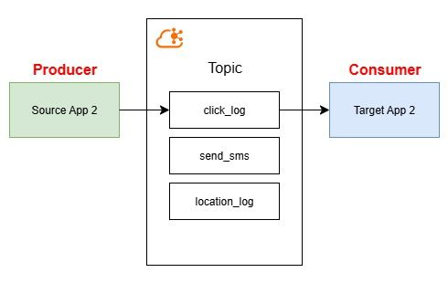

Source App이 특정 토픽에 이벤트를 게시하고, Target App은 해당 토픽을 구독하여 이벤트를 수신합니다.

이때 이벤트를 게시하는 클라이언트 애플리케이션 (Source App)을 **프로듀서Producer**, 이벤트를 구독하여 읽고 처리하는 애플리케이션 (Target App) 을 **컨슈머Consumer** 라고 합니다.

토픽은 “click_log”, “payment”와 같이 도메인에 연관된 이름을 설정할 수 있으며, 하나의 토픽에 여러 프로듀서가 이벤트를 발행하거나, 여러 컨슈머가 구독할 수 있습니다.

이제 토픽의 구성 요소인 파티션에 대해 알아봅시다.

### 2. 파티션 (Partition), 오프셋 (Offset), 컨슈머 그룹(Consumer Group)

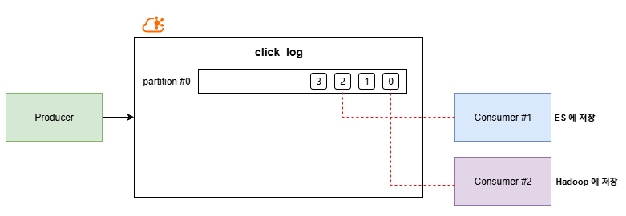

**파티션 Partition**은 하나의 토픽을 물리적으로 분할한 단위입니다. 따라서 실제 이벤트 데이터는 토픽 내부의 파티션 중 하나에 저장됩니다. 토픽은 여러 개의 파티션으로 구성될 수 있으며 파티션 번호는 0번부터 시작합니다.

각각의 파티션은 큐(Queue)처럼 동작하며, 프로듀서가 게시한 이벤트는 파티션 내부에 순서대로 저장됩니다.

컨슈머는 해당 파티션에서 오래된 데이터부터 순서대로 읽어갑니다. 가장 최신 데이터까지 읽은 컨슈머는 또 다른 이벤트가 들어올 때까지 대기합니다.

기존 MQ 모델과 달리, 카프카의 파티션에 저장된 데이터는 컨슈머가 읽어가도 삭제되지 않습니다.

파티션은 최대 보존 기간(`log.retention.hours`)과 최대 보존 용량(`log.retention.byte`)을 설정할 수 있으며 이를 통해 적절히 데이터를 보존/삭제합니다.

이러한 특징 덕에 특정 컨슈머의 읽기 여부와 무관하게 다른 *컨슈머 그룹에서도 동일 파티션을 첫 데이터부터 읽을 수 있습니다.

* `auto.offset.reset = earlist` 설정이 전제 되어야 합니다.

**동일 데이터의 복수 처리**는 카프카의 주요 장점 중 하나로, 예를 들어 “click_log” 토픽에서 클릭 로그의 분석을 위해 Elasticsearch에 데이터를 저장하고, 클릭 로그를 백업하기 위해 Hadoop에 저장하기도 하는 등의 활용이 가능합니다.

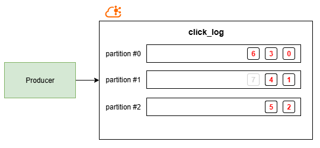

위와 같이 토픽 내부에 여러 개의 파티션이 존재할 경우, 이벤트가 저장되는 파티션은 아래와 같이 결정됩니다.

1. 이벤트에 지정된 Key가 존재하는 경우, Key의 해시값에 따라 특정 파티션에 할당
    1. 같은 Key 를 갖는 데이터는 같은 파티션에 저장 → 데이터 간 순서를 보장
2. Key가 존재하지 않는 경우`null`, **Round-Robin** 방식으로 할당

따라서 파티션 3개인 토픽에 Key 값이 없는 일반 이벤트 7개를 요청한다면 위 그림과 같이 Round-Robin 방식으로 저장됩니다.

파티션 갯수는 늘릴 수는 있지만, 다시 줄일 수는 없으므로 파티션 확장은 신중하게 결정해야 합니다.

---

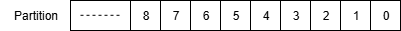

이때 파티션 내에서 데이터의 위치를 나타내는 고유 번호를 **오프셋 Offset**이라고 합니다.

오프셋은 파티션 별로 존재하며, 카프카는 내부 토픽 `__consumer_offsets` 을 활용해 컨슈머가 파티션의 데이터를 어디까지 읽었는지 기억합니다.

**컨슈머 그룹 ConsumerGroup**은 개별 컨슈머 인스턴스들을 하나로 묶은 논리적 단위입니다.

카프카의 컨슈머 그룹은 파티션 병렬 처리, 중복 읽기 방지, 장애 복구의 특징을 가집니다.

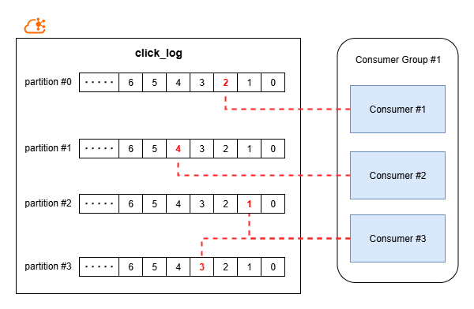

**[파티션 병렬 읽기]**

같은 컨슈머 그룹에 속한 컨슈머들은 토픽 내 서로 다른 파티션에 할당되어 토픽 내 데이터를 병렬적으로 읽습니다.

이 때 컨슈머 그룹 내에서 파티션 1개당 컨슈머 1개만 할당할 수 있습니다.

파티션 수에 비해 컨슈머의 수가 모자란 경우에는 하나의 컨슈머가 여러 파티션을 담당하여 작업합니다.

반대로 그룹 내 컨슈머 수가 파티션 수를 초과할 경우, 아무 작업 없이 노는 컨슈머가 생기므로 주의해야 합니다.

**[중복 읽기 방지]**

파티션 별로 커밋된 오프셋의 위치 정보는 컨슈머 그룹 단위로 관리됩니다.

따라서 특정 컨슈머가 파티션 P1의 offset 10까지 읽었다면, 다음에 P1을 읽는 동일 컨슈머 그룹 내의 다른 컨슈머는 P1의 offest 11부터 데이터를 읽어 데이터 중복 읽기를 방지합니다.

**[장애 복구]**

만약 작업 중인 컨슈머에 장애가 발생하면 같은 그룹의 다른 컨슈머가 해당 파티션을 재 할당 받아 처리하여 컨슈머 그룹 내 가용성을 확보합니다.

### 3. 브로커(Broker), 복제 & ISR (Replication & ISR)

앞서 카프카로 데이터를 보내는 클라이언트인 Producer 와 카프카에서 데이터를 가져가는 클라이언트인 Consumer 를 알아보았습니다.

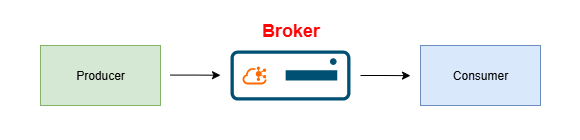

Producer와 Consumer가 데이터를 전송/요청하는 대상이자, 카프카 애플리케이션이 실행 중인 서버를 **브로커**라고 합니다.

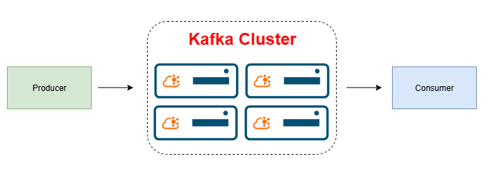

브로커 여러 개가 모여 구성하는 카프카 시스템을 **카프카 클러스터(Kafka Cluster)** 라고 합니다.

보통의 경우 **3개 이상의 브로커**로 클러스터를 구성하는 것이 권장되는데, 이는 **부하 분산(Load Balancing)** 과 **가용성(Availability)** 을 높이기 위함입니다.

이제 카프카 부하 분산과 가용성의 핵심 원리인 복제(Replication)에 대해 알아봅시다

---

카프카에서 데이터를 저장하는 기본 단위는 **토픽 Topic** 입니다.

토픽을 생성할 때 설정할 수 있는 중요한 옵션 중 하나가 바로 **복제 개수`replication-factor`** 인데요.

이 값은 **각 파티션이 몇 개의 브로커에 복제되어 저장될 지를 결정**합니다.

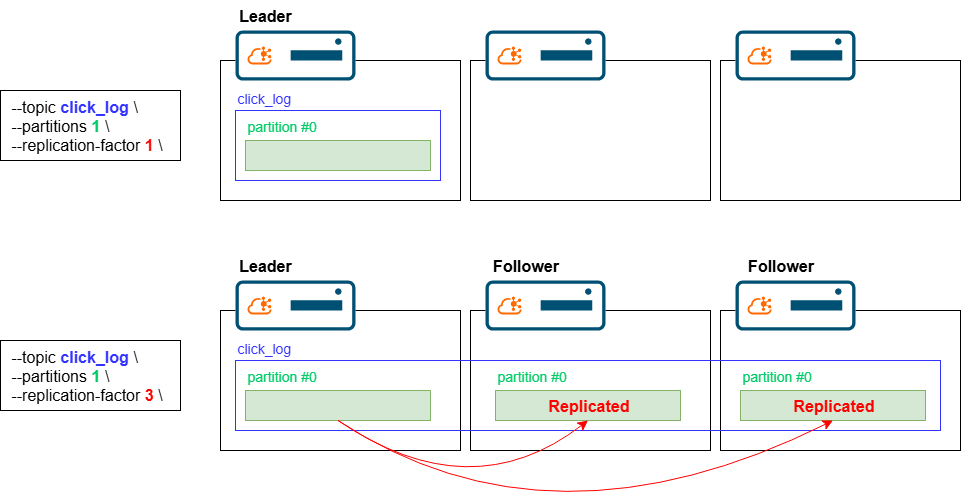

예를 들어, `replication-factor=1` 인 경우에는 하나의 파티션 데이터는 하나의 브로커에만 저장되지만,

`replication-factor=3` 으로 설정했다면 하나의 파티션 데이터가 **3개의 브로커에 동일하게 저장**됩니다.

복제된 파티션들 중 하나는 **리더(Leader)** 로, 나머지는 **팔로워(Follower)** 로 지정됩니다.

리더는 프로듀서와 컨슈머가 직접 데이터를 주고받는 메인 파티션이고, 팔로워는 리더의 데이터를 주기적으로 복제하는 파티션입니다.

각 팔로워는 리더의 최신 데이터를 지속적으로 따라가며 **동기화하는데,** 이 과정을 **레플리케이션 (Replication)** 이라고 부릅니다.

예를 들어 특정 토픽의 `--partitions=3`, `replication-factor=3`으로 설정하면 아래와 같은 구조를 갖습니다.

| 파티션 | 리더(Leader) | 팔로워1 | 팔로워2 |
| --- | --- | --- | --- |
| `partition-0` | Broker 1 | Broker 2 | Broker 3 |
| `partition-1` | Broker 2 | Broker 3 | Broker 1 |
| `partition-2` | Broker 3 | Broker 1 | Broker 2 |

---

그런데 모든 팔로워가 항상 리더의 최신 데이터를 갖고 있는 것은 아닙니다.

팔로워의 데이터 복제 과정에도 네트워크 지연이나 장애가 발생 할 수 있기 때문이에요.

그래서 카프카는 **리더와 완전히 동기화된 복제본 집합**을 따로 관리하는데, 이걸 **ISR(In-Sync Replica)** 라고 합니다.

만약 리더 브로커에 장애가 생기면 ISR의 다른 브로커가 리더 역할을 승계하여 안정적인 서비스를 지속할 수 있습니다.

이러한 복제와 ISR 구조 덕분에 Kafka는 장애 상황에서도 데이터 손실을 최소화하고 서비스 연속성을 유지할 수 있습니다.

또한 파티션마다 여러 브로커에 리더와 팔로워 역할이 균형 있게 분배되면서 클러스터 전체의 부하가 자연스럽게 분산되고, 이는 Kafka가 **고가용성과 확장성**을 동시에 실현하는 핵심 원리가 됩니다.

---
## 정리
지금까지 아파치 카프카의 정의, 등장 및 활성화 배경, 그리고 핵심 구성 요소 별 원리에 대해 알아보았습니다.

카프카는 분산 이벤트 스트리밍 플랫폼으로서, MSA 환경에서 데이터의 결합도를 낮추고 고가용성 및 확장성을 확보하는 중앙 이벤트 허브로서의 역할을 합니다.

특히 파티션, 오프셋, 브로커, ISR로 이어지는 구조는 데이터의 손실없는 안정적인 처리를 보장하며, 이러한 강점이 비즈니스 로직의 연속성을 극대화합니다.  

